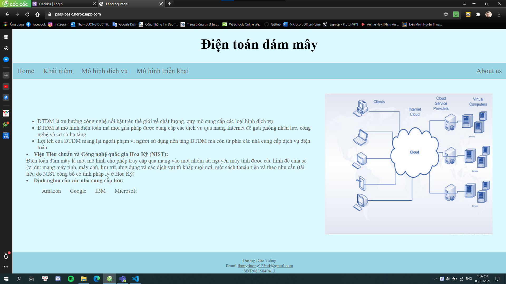
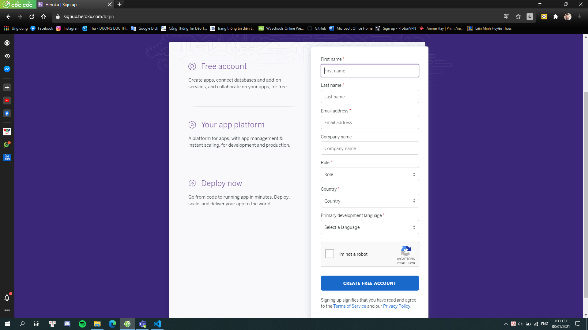
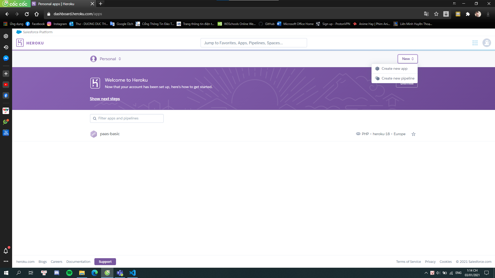
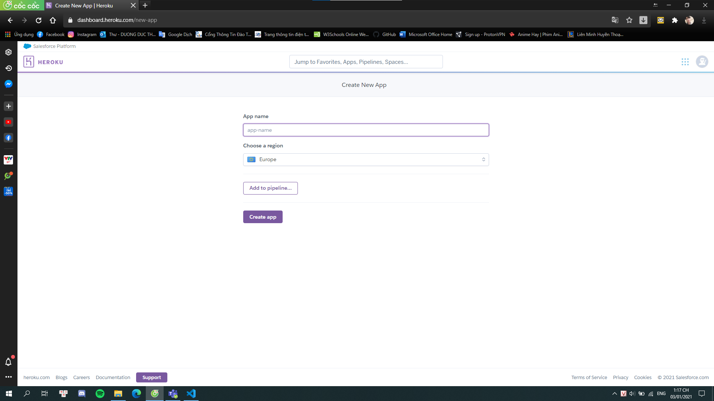
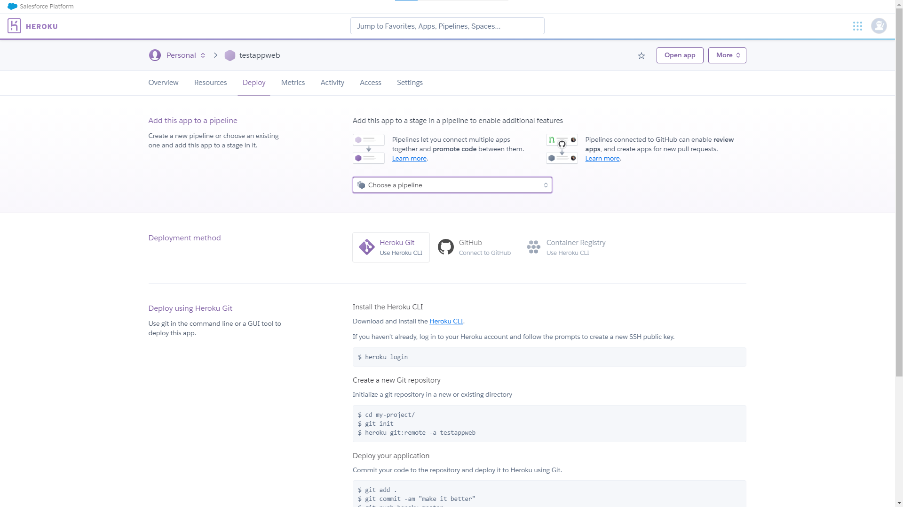
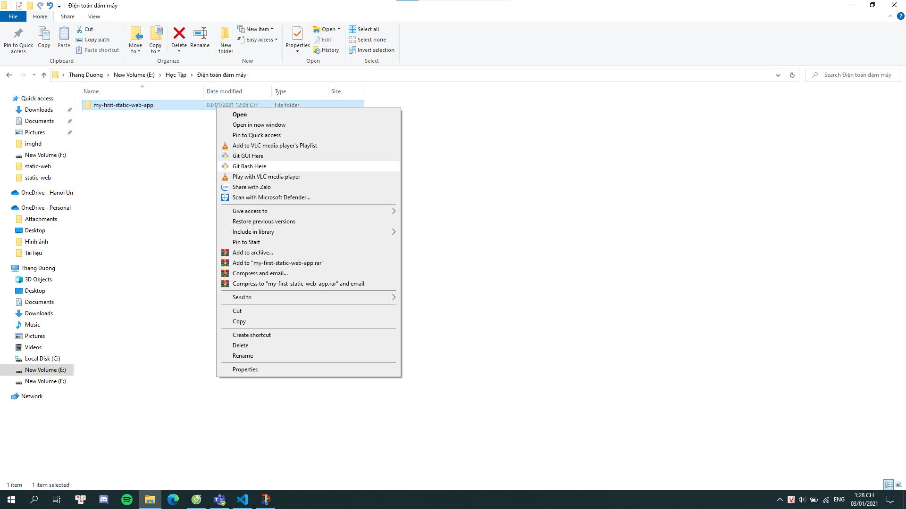
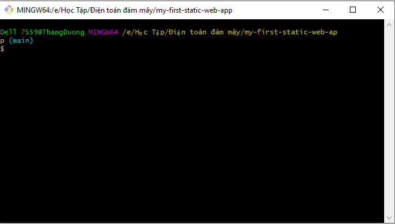
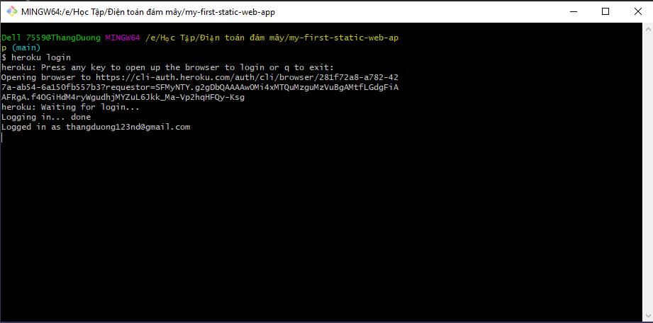
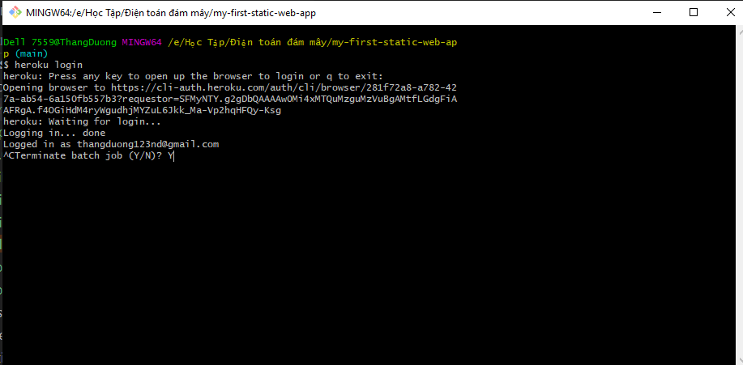
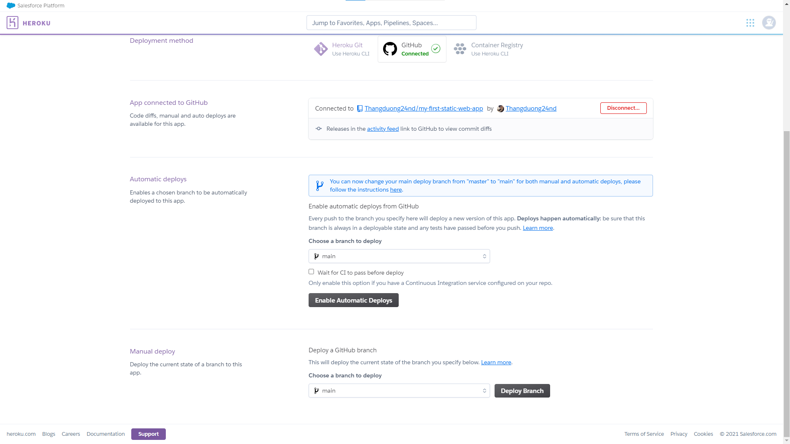

# My Static Web App
Triển khai ứng dụng Web trên dịch vụ nền tảng điện toán đám mây.
(Đây là phần thực hành của nội dung chương 4 trong học phần *Điện toán đám mây và ứng dụng* đang được giảng dạy tại Khoa Công nghệ thông tin của Trường Đại học Mỏ - Địa chất)

## Giới thiệu
**Heroku** là một dịch vụ nền tảng điện toán đám mây cho phép chúng ta xây dựng các ứng dụng web hiện đại, tự động xuất bản từ những thay đổi được thực hiện ngay trong **GitHub Actions**.

Trong bài viết này, tôi sẽ tiến hành xây dựng một ứng dụng web và triển khai nó theo giải pháp điện toán đám mây của **Heroku**.

Đây là ứng dụng mà tôi sẽ xây dựng trong bài viết này


Nó trông thực sự rất đơn giản nhưng ứng dụng này lại được xây dựng và triển khai tự động trên dịch vụ nền tảng điện toán đám mây sử dụng GitHub Actions.


## Mở đầu
Azure Static Web Apps xuất bản ứng dụng web cho người dùng bằng cách xây dựng các ứng dụng từ kho quản lý và lưu trữ mã nguồn GitHub. Trong phần mở đầu này, chúng ta triển khai ứng dụng web cho Azure Static Web Apps bằng công cụ môi trường viết mã Visual Studio Code.

### Điều kiện tiên quyết
- Có tài khoản [GitHub](https://github.com/)
- Có tài khoản [Heroku](https://https://id.heroku.com/login)
- Môi trường viết mã [Visual Studio Code](https://code.visualstudio.com/)
- Phần mềm quản lý mã nguồn [Git for Windows](https://git-scm.com/downloads) hoặc [Git for macOS](https://git-scm.com/download/mac). Nếu bạn đã cài đặt Git, bạn có thể tải phiên bản phát triển mới nhất thông qua chính lệnh Git: ```git clone https://github.com/git/git```.
- [Live Server extension](https://marketplace.visualstudio.com/items?itemName=ritwickdey.LiveServer) cho Visual Studio Code

### Tạo một kho lưu trữ
Bài viết này sử dụng kho lưu trữ mẫu (template) GitHub để giúp bạn dễ dàng bắt đầu. Mẫu có một ứng dụng web tĩnh rất đơn giản để chúng ta có thể sử dụng như một điểm khởi đầu.

> 1. Đảm bảo rằng bạn đã đăng nhập vào GitHub và điều hướng đến vị trí sau để tạo một kho lưu trữ mới:
https://github.com/chuyentt/paas-basic/generate - nếu liên kết không hoạt động, vui lòng đăng nhập vào GitHub và thử lại.
> 2. Đặt tên cho Repository name (kho lưu trữ mã nguồn) của bạn là:
`my-first-static-web-app`

Chọn **`Create repository from template`**.

### Sao chép kho lưu trữ
Với kho lưu trữ được tạo trong tài khoản GitHub của bạn, hãy sao chép dự án vào máy cục bộ của bạn bằng lệnh sau với công cụ giao tiếp dòng lệnh `Command Prompt` trên Windows hoặc `terminal` trên macOS.
`git clone https://github.com/<YOUR_ACCOUNT_NAME>/my-first-static-web-app.git`

Hoặc sao chép nó về bằng công cụ `Visual Studio Code` bằng cách đi đến menu *`View > Command Palette...`* rồi nhập `Git: Clone` sau đó cung cấp URL của kho lưu trữ hoặc chọn nguồn kho lưu trữ `https://github.com/<YOUR_ACCOUNT_NAME>/my-first-static-web-app.git`.

Chọn nơi lưu trữ kho mã nguồn trên máy tính, chờ một lúc và mở nó ra để tiếp tục viết mã, đây thực sự là một trang web tĩnh đơn giản nhất để chúng ta bắt đầu. Nó chỉ có một tệp `index.html` chứa vài dòng văn bản được cấu trúc bằng mã của ngôn ngữ `HTML`, nó sẽ trả về một vài dòng văn bản trên trình duyệt cùng với một tệp mã CSS dùng để trình bày kiểu dáng cho những văn bản đó (nếu các bạn đã biết về HTML/CSS/JavaScript sẽ là một lợi thế).

Chúng ta có thể xem trước trang web này trên máy chủ cục bộ bằng cách sử dụng một `Extensions` (thành phần mở rộng) cho `Visual Studio Code` có tên là `Live Server`.

Chúng ta sẽ đi đến tệp `index.html`, click chuột phải và chọn `Open with Live Server`,  điều này sẽ mở một tab mới trên trình duyệt và hiển thị ứng dụng web.
### Tạo một ứng dụng web tĩnh
1.Đăng kí tài khoản Heroku
 - Điền các thông tin cần thiết để tạo tài khoản Heroku
 

2. Đăng nhập vào Heroku
3. Sau khi đăng nhập ta tiến hành tạo 1 app
Nhấn vào **Create new app** 

4. Nhập tên app, vào chọn khu vực **Europe**

5. Sau khi tạo app, sẽ có giao diện như sau:

6. Tiếp đó, ta sẽ tiến hành đẩy tài nguyên lên app
  Ở đây ta có 2 cách chính để đẩy tài nguyên lên: Sử dụng Heroku CLI và Đẩy tài nguyên thông qua Github
  **Cách 1:** Sử dụng Heroku CLI
   - Bước 1: Trỏ tới thư mục chứa code, click chuột phải, chọn **GUI BASH here**
   
   Sau đó sẽ hiện ra giao diện sau
   
   Ta sẽ thực hiện các thao tác trên đây
   - Bước 2: Gõ câu lệnh **$ heroku login** và đăng nhập tài khoản Heroku
   
   Nhấn tổ hợp phím **CTRl + C** và chọn **Y** để tiếp tục thực hiện các câu lệnh
   
   - Bước 3: Thực hiện các cậu lệnh để đẩy các tài nguyên lên app:
      - B3.1 **$ git int**
      - B3.2 **$ heroku git:remote -a {tên app}** (Tạo cấu hình đến app)
      - B3.3  **$ git add .**
      - B3.4 **$ git commit -am "{chú thích}"**
      - B3.5 **$ git push heroku {nhánh}** (Nhánh ở đây thường là **main** hoặc **maste**, được hiện thị ở trên giao diên **GUI BASH**)
Chờ đợi để upload tài nguyên
Trang web của ta sẽ có địa chỉ là **{tên app}.herokuapp.com**
**Cách 2:** Đẩy tài nguyên thông qua Github
   - Ở phần giao diện app, chọn **Deloy** -> Chọn **Github** -> Sau đó chọn kho lữu trữ mã cần triển khai
   - Sau khi đã kết nối, chọn nhánh và chọn **Deploy Branch** để upload tài nguyên lên 
   
   Trang web của ta sẽ có địa chỉ là **{tên app}.herokuapp.com**

     